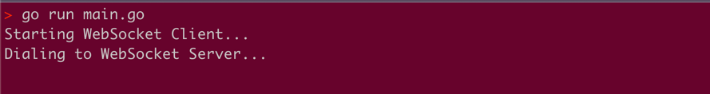
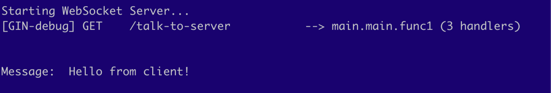
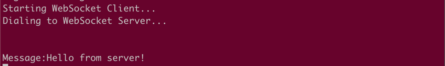

## WebSockets in Go: A hijackers' perspective 


In the previous blog, we did a deep dive into WebSockets.
In this blog, let's build a WebSocket client and server in golang and do a code deep dive.

While we do that, let's also draw parallels between what we understood in the previous blog and the golang code we write.

We'll be using WebSocket library: ["github.com/gorilla/websocket"](https://github.com/gorilla/websocket)

Let's start with the client, Why? Because that's what initiates the WebSocket request.

Below, the client "Dials" the origin server. Observe that `URL` starts with `ws` which represents WebSocket protocol. 
```go
    import "github.com/gorilla/websocket"
    
    func main() {
        URL := "ws://localhost:8080/talk-to-server"
        
        conn, _, err := websocket.DefaultDialer.Dial(URL, nil)
    }
    
```

Wondering what `Dial()` really does? - If you dig a little deeper into the library,
you'll see it simply sends an `HTTP1.1` request with `Upgrade` header.
Have a look at this code: https://github.com/golang/net/blob/master/websocket/hybi.go#L412

Now, if the WebSocket server accepts this request. We are good...else Error!!

Let's look at what really happens on the server end.
```go
import (
    "github.com/gin-gonic/gin"
    "github.com/gorilla/websocket"
    "net/http"
)

func main() {
    fmt.Println("Starting WebSocket Server...")
    httpServer := gin.Default()

    httpServer.GET("/talk-to-server", handleWebsocket)
    
    err := http.ListenAndServe(":8080", httpServer)
    if err != nil {...}
}
```

For starters, we have just initialised an HTTP server listening on port `8080`.
Nothing websockety so far.
Next we register an endpoint `/talk-to-server` to our http server 

We'll make this endpoint capable of upgrading to WebSocket. 

The `gorilla/websocket` library provides an `Upgrader` interface with an `Upgrade()` func

```go
func (u *Upgrader) Upgrade(w http.ResponseWriter, r *http.Request, responseHeader http.Header) (*Conn, error) 
```

Let's look at how we use the above in the `handleWebSocket` function:

```go
import (
    "github.com/gin-gonic/gin"
    "github.com/gorilla/websocket"
    "net/http"
)
func main() {
    ...
    httpServer.GET("/talk-to-server", handleWebsocket)
    ...
}

func handleWebSocket(ginContext *gin.Context) {

    upgrader := websocket.Upgrader{}

    //Upgrader upgrades the HTTP connection to WebSocket
    
    websocketConn, err := upgrader.Upgrade(
        ginContext.Writer,
        context.Request,
        nil)
    
    if err != nil {...}
}
```

The `Upgrade()` func takes in 3 params :

1. `http.ResponseWriter`: That's the main actor that upgrades the connection. Hold on you'll know shortly 
2. `*http.Request`: In order to read or validate all headers sent by WebSocket client - that helps in giving the verdict of whether to upgrade or not.
3. `http.Header`: To set custom sub-protocol under WebSocket (set only if http connection is successfully upgraded to WebSocket). We have set it to nil for simplicity.

If all the validations are met, the `Upgrade()` function returns a WebSocket connection instance. Yayy! 

Once we know it's valid, the server needs to reply with a handshake response.

Had it been a normal HTTP connection, we could have used `http.ResponseWriter` to write back the response.
But we can’t use it here as it will close the underlying tcp connection once the response is sent. :(

Time to introduce `http.Hijacker`.


`http.Hijacker` is an interface with a `Hijack()` function that returns underlying TCP connection.

The library code looks something like:
```go
func (u *Upgrader) Upgrade(w http.ResponseWriter, r *http.Request, responseHeader http.Header) (*Conn, error) {    
    ...
    h, ok := w.(http.Hijacker)      //Typecasting the http.ResponseWriter to http.Hijacker
    if !ok {...}
    
    var brw *bufio.ReadWriter
    netConn, brw, err := h.Hijack()     //Hijacked !!!    
    if err != nil {...}
    ...
}
```

`netConn` is essentially our raw TCP connection.

This allows us:
1. To write directly on raw TCP connection.
   Since it's a WebSocket we are upgrading to, the server needs to write some headers like
   `HTTP/1.1 101 Switching Protocols 
    Upgrade: websocket 
    Connection: Upgrade`

2. To manage and close the connection at will, which is what we need for WebSockets. [emoticon]


As a consumer of the library, once you get a hold of WebSocket connection...Voilà! You can read or write messages onto it!

```go
//reading message...
_, message, err := websocketConn.ReadMessage()
if err != nil {...}
fmt.Println("Message: ",  string(message))

//writing message...
err = websocketConn.WriteMessage(websocket.TextMessage, []byte("Hello from server!"))
if err != nil {...}
```

Similarly, the client can also write/read on the WebSocket connection using similar apis.

Finally, your code will look like:

**Client:**
```go
package main

import (
	"fmt"
	"github.com/gorilla/websocket"
)

func main() {
	url := "ws://localhost:8080/talk-to-server"

	conn, _, err := websocket.DefaultDialer.Dial(url, nil)
	if err != nil {...}

	//Sending message...
	err := conn.WriteMessage(websocket.TextMessage, []byte("Hello from client!\n"));
	if err != nil {...}

	//Reading message...
	_, message, err := conn.ReadMessage()
	if err != nil {...}
	
	fmt.Print("Received:", string(message))
}

```

**Server:**
```go
package main

import (
	"fmt"
	"github.com/gin-gonic/gin"
	"github.com/gorilla/websocket"
	"net/http"
)

func main() {
	httpServer := gin.Default()

	upgrader := websocket.Upgrader{}

	httpServer.GET("/talk-to-server", func(context *gin.Context) {
		websocketConn, err := upgrader.Upgrade(context.Writer, context.Request, nil)
		if err != nil {...}

		_, message, err := websocketConn.ReadMessage()
		if err != nil {...}
		fmt.Println("Message: ", string(message))

		err = websocketConn.WriteMessage(websocket.TextMessage, []byte("Hello from server!\n"))
		if err != nil {...}
	})

	err := http.ListenAndServe(":8080", httpServer)
	if err != nil {...}
}
```

Let's run it !
First bring up the WebSocket server:


Now let's initiate the client's WebSocket request with `Dial()`


Once the server receives client's request, it accepts and upgrades to WebSocket connection,
Right after connection is established, we see client sends it a message, and we see:



The server responds back to client with a message:


Hopefully this blog helps you build your WebSocket client and server in golang. 
Let me know in the comments if you have any questions or feedbacks! Happy Coding! 👩‍💻 
